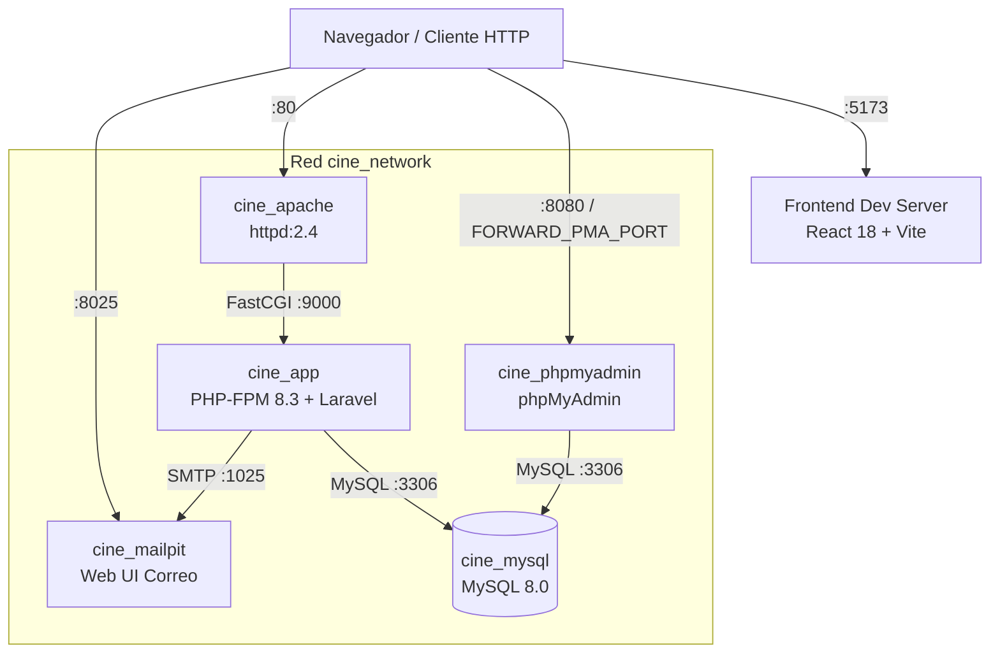
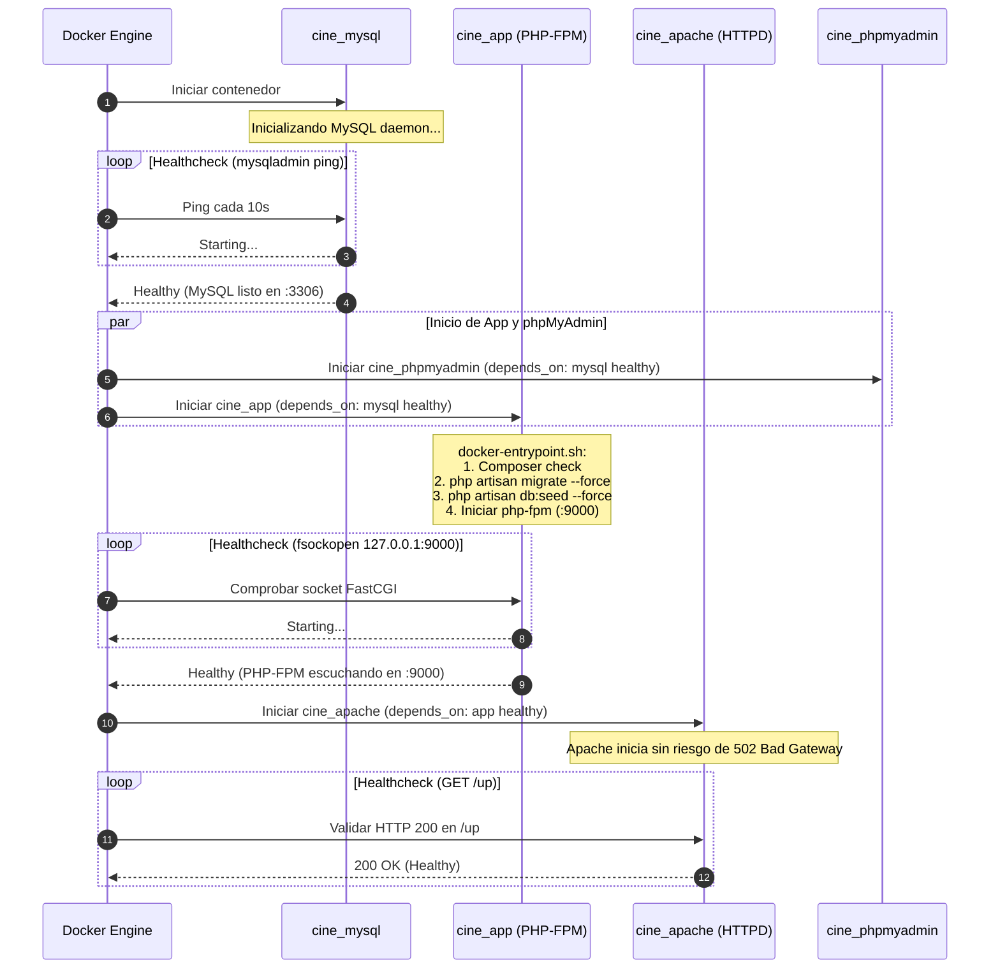

# Entorno de Desarrollo — Docker Compose, Orquestación y Variables

Este documento detalla la arquitectura de contenedores, la orquestación del orden de arranque con healthchecks (`feat/29-healthchecks-depends-on`) y la gestión centralizada de variables de entorno (`fix/28-docker-env-file`) para el entorno de desarrollo local de Cine Sendera.

---

## 1. Visión General de la Infraestructura de Desarrollo

El entorno de desarrollo emula una arquitectura LAMP moderna desacoplada en contenedores Docker bajo el principio de **un solo proceso por contenedor**:



### Servicios en `docker-compose.yml`

| Servicio | Contenedor | Imagen / Base | Puerto Interno | Puerto Host | Responsabilidad Principal |
| :--- | :--- | :--- | :--- | :--- | :--- |
| `app` | `cine_app` | `docker/php/Dockerfile` (PHP 8.3-FPM) | `9000` | No expuesto al host | Ejecuta Laravel, procesa peticiones FastCGI, corre migraciones y seeders. |
| `apache` | `cine_apache` | `httpd:2.4` | `80` | `80:80` | Servidor web perimetral. Sirve estáticos y reenvía rutas dinámicas a `cine_app:9000`. |
| `mysql` | `cine_mysql` | `mysql:8.0` | `3306` | `${FORWARD_DB_PORT:-3306}:3306` | Base de datos relacional con volumen persistente `mysql_data`. |
| `phpmyadmin` | `cine_phpmyadmin` | `phpmyadmin/phpmyadmin` | `80` | `${FORWARD_PMA_PORT:-8080}:80` | Interfaz web de administración de base de datos. |
| `mailpit` | `cine_mailpit` | `axllent/mailpit:latest` | `1025` (SMTP), `8025` (UI) | `1025:1025`, `8025:8025` | Servidor SMTP local para captura e inspección de emails generados por el sistema. |

---

## 2. Gestión Centralizada de Variables de Entorno (`fix/28-docker-env-file`)

### 2.1 Problema Previo y Motivación
Anteriormente, el servicio `app` en `docker-compose.yml` declaraba explícitamente más de 40 variables de entorno bajo la directiva `environment:` (`APP_NAME: ${APP_NAME}`, `DB_HOST: ${DB_HOST}`, etc.). 

Esto generaba:
1. **Duplicación masiva y fragilidad:** Cada nueva variable requerida por Laravel obligaba a modificar simultáneamente `.env.example`, `.env` y `docker-compose.yml`.
2. **Riesgo de omisión y desincronización:** Variables agregadas en `.env` no eran transferidas al contenedor si se olvidaba registrarlas en Compose.
3. **Mantenimiento pesado:** Dificultad para auditar y depurar configuraciones.

### 2.2 Solución Implementada: Directiva `env_file`
Se refactorizó el servicio `app` para consumir directamente el archivo de configuración:

```yaml
services:
  app:
    # ...
    env_file:
      - .env
    # ...
```

#### Ventajas:
- **Single Source of Truth:** `.env` es el único lugar donde se definen y ajustan los valores.
- **Inyección Transparente:** Todas las variables de entorno de Laravel (Sanctum, Cache, Queue, Mail, DB, AWS, etc.) quedan disponibles de forma automática para PHP-FPM y Artisan.
- **Limpieza del archivo de orquestación:** Reducción drástica de líneas redundantes en `docker-compose.yml`.

### 2.3 Mapeo Flexible de Puertos de Host (`FORWARD_*`)
Para evitar colisiones cuando un desarrollador ya tiene servicios locales corriendo en su máquina anfitriona (por ejemplo, otro MySQL en el puerto 3306 u otro servicio en el puerto 8080), se implementó parametrización con valores por defecto:

```yaml
services:
  mysql:
    ports:
      - "${FORWARD_DB_PORT:-3306}:3306"

  phpmyadmin:
    ports:
      - "${FORWARD_PMA_PORT:-8080}:80"
```

Configuración en `.env.example` / `.env`:
```env
# Puertos opcionales de host (para evitar colisiones locales)
FORWARD_DB_PORT=3308
FORWARD_PMA_PORT=8081
```

> **Nota arquitectónica:** La comunicación interna entre contenedores dentro de `cine_network` siempre usa los puertos estándar (`mysql:3306`, `app:9000`). Los parámetros `FORWARD_*` afectan **únicamente** el acceso desde la máquina host (ej. desde DataGrip, DBeaver o el navegador).

### 2.4 Reglas Críticas del Parser de `env_file`
Docker Compose utiliza un parser estricto para archivos `.env`:
- **Comentarios:** Deben ir en su propia línea comenzando con `#` (ej. `# Configuración de BD`).
- **Prohibido comentarios en línea (inline comments):** Escribir `APP_KEY=base64:... # clave de app` provocará que Docker incluya `# clave de app` como parte literal del valor de la variable, rompiendo la aplicación con errores `500`.

---

## 3. Orquestación de Arranque y Healthchecks (`feat/29-healthchecks-depends-on`)

### 3.1 Problema Previo: Race Conditions al Iniciar el Stack
Un `depends_on` básico en Docker Compose solo espera a que el contenedor destino esté en estado de ejecución (*running*), no a que el proceso interno esté listo para recibir peticiones (*ready/healthy*).

Esto provocaba tres fallos intermitentes graves en arranques limpios (`docker compose up`):
1. **Fallo en Migraciones / Seeders:** El contenedor `cine_app` iniciaba de inmediato e intentaba ejecutar `php artisan migrate --seed` mientras `cine_mysql` aún estaba inicializando tablas del sistema y permisos, resultando en `SQLSTATE[HY000] [2002] Connection refused`.
2. **Error 502 Bad Gateway en Apache:** `cine_apache` arrancaba antes de que PHP-FPM abriera el puerto FastCGI `9000`, arrojando errores `Proxy Error: Could not connect to remote machine` o `FastCGI: unable to connect to server`.
3. **Pantallas de error en phpMyAdmin:** Intentos de conexión fallidos hacia MySQL durante el arranque.

### 3.2 Solución Implementada: Healthchecks y `service_healthy`

Se configuraron healthchecks nativos y dependencias condicionadas a la salud de los servicios:



### 3.3 Especificación Técnica de Healthchecks

#### 1. Base de Datos (`cine_mysql`)
```yaml
healthcheck:
  test: ["CMD", "mysqladmin", "ping", "-h", "localhost", "-u", "root", "-p$$MYSQL_ROOT_PASSWORD"]
  interval: 10s
  timeout: 5s
  retries: 5
  start_period: 30s
```
- **Mecanismo:** `mysqladmin ping` verifica que el motor InnoDB y el socket TCP de MySQL respondan a consultas autenticadas.
- **`start_period: 30s`:** Ventana de gracia para que MySQL realice la inicialización de archivos de datos sin marcar fallos prematuros.

#### 2. Backend PHP-FPM (`cine_app`)
```yaml
healthcheck:
  test: ["CMD", "php", "-r", "$$fp = @fsockopen('127.0.0.1', 9000); exit($$fp ? 0 : 1);"]
  interval: 10s
  timeout: 5s
  retries: 5
  start_period: 30s
```
- **Mecanismo:** Script PHP inline que abre un socket TCP contra el puerto `9000` de PHP-FPM. Si la conexión es exitosa retorna `0` (Healthy); si falla retorna `1` (Unhealthy).
- **`start_period: 30s`:** Permite que `docker-entrypoint.sh` ejecute las migraciones y seeders de la base de datos antes de que el healthcheck comience a evaluar el estado del servicio.
- **Dependencia de arranque:**
  ```yaml
  depends_on:
    mysql:
      condition: service_healthy
  ```

#### 3. Servidor Web Apache (`cine_apache`)
```yaml
healthcheck:
  test: ["CMD-SHELL", "bash -c 'exec 3<>/dev/tcp/127.0.0.1/80 && printf \"GET /up HTTP/1.0\\r\\nHost: localhost\\r\\n\\r\\n\" >&3 && read -r line <&3 && [[ \"$$line\" =~ 200 ]]'"]
  interval: 10s
  timeout: 5s
  retries: 3
  start_period: 10s
```
- **Mecanismo:** Petición HTTP nativa usando descriptores de archivo y sockets Bash (`/dev/tcp`) solicitando el endpoint `/up` de Laravel (healthcheck endpoint) y verificando que la respuesta contenga el código de estado `200`.
- **Dependencia de arranque:**
  ```yaml
  depends_on:
    app:
      condition: service_healthy
  ```

#### 4. Interfaz phpMyAdmin (`cine_phpmyadmin`)
```yaml
depends_on:
  mysql:
    condition: service_healthy
```
- Garantiza que la interfaz web no intente levantar sesiones contra un motor MySQL no inicializado.

---

## 4. Guía de Operación y Comandos Útiles

### Iniciar el entorno completo
```bash
# Arrancar en segundo plano con control de dependencias
docker compose up -d

# Ver el estado detallado de salud de los contenedores
docker compose ps
```

Ejemplo de salida esperada:
```
NAME              IMAGE                   COMMAND                  SERVICE      CREATED         STATUS                   PORTS
cine_apache       httpd:2.4               "httpd-foreground"       apache       1 minute ago    Up 1 minute (healthy)    0.0.0.0:80->80/tcp
cine_app          cine_web-app            "docker-entrypoint.sh…"  app          1 minute ago    Up 1 minute (healthy)    9000/tcp
cine_mailpit      axllent/mailpit:latest  "/mailpit"               mailpit      1 minute ago    Up 1 minute (healthy)    0.0.0.0:1025->1025/tcp, 0.0.0.0:8025->8025/tcp
cine_mysql        mysql:8.0               "docker-entrypoint.s…"   mysql        1 minute ago    Up 1 minute (healthy)    0.0.0.0:3308->3306/tcp
cine_phpmyadmin   phpmyadmin/phpmyadmin   "/docker-entrypoint.…"   phpmyadmin   1 minute ago    Up 1 minute              0.0.0.0:8081->80/tcp
```

### Inspección de Healthchecks
```bash
# Ver el último resultado del healthcheck de app
docker inspect --format='{{json .State.Health}}' cine_app

# Ver logs del entrypoint y de Laravel
docker compose logs -f app
```

### Reinicio y reconstrucción limpia
```bash
# Detener contenedores manteniendo volúmenes de datos
docker compose down

# Reconstruir imágenes tras cambios en Dockerfile o configuración
docker compose up -d --build
```

---

## 5. Resumen Técnico para Diapositivas / Presentaciones

Para la presentación del proyecto o diapositivas del equipo, los puntos clave a destacar son:

1. **Arquitectura desacoplada LAMP:** Separación estricta de Apache (servidor perimetral/estáticos) y PHP-FPM (procesamiento de lógica Laravel en worker pool).
2. **Centralización y Configuración Limpia (PR #28):**
   - Implementación de `env_file: .env` para eliminar redundancia de más de 40 variables en Compose.
   - Aislamiento de puertos de host mediante `FORWARD_DB_PORT` y `FORWARD_PMA_PORT` para prevenir colisiones en estaciones de trabajo de los desarrolladores.
3. **Orquestación Resiliente y Cero Race Conditions (PR #29):**
   - Implementación de healthchecks a nivel de base de datos (`mysqladmin ping`), aplicación (`fsockopen :9000`) y servidor web (`HTTP GET /up`).
   - Arranque determinista y ordenado con `depends_on: condition: service_healthy` (MySQL $\rightarrow$ App $\rightarrow$ Apache), eliminando por completo los errores `502 Bad Gateway` y fallos en migraciones automáticas.
