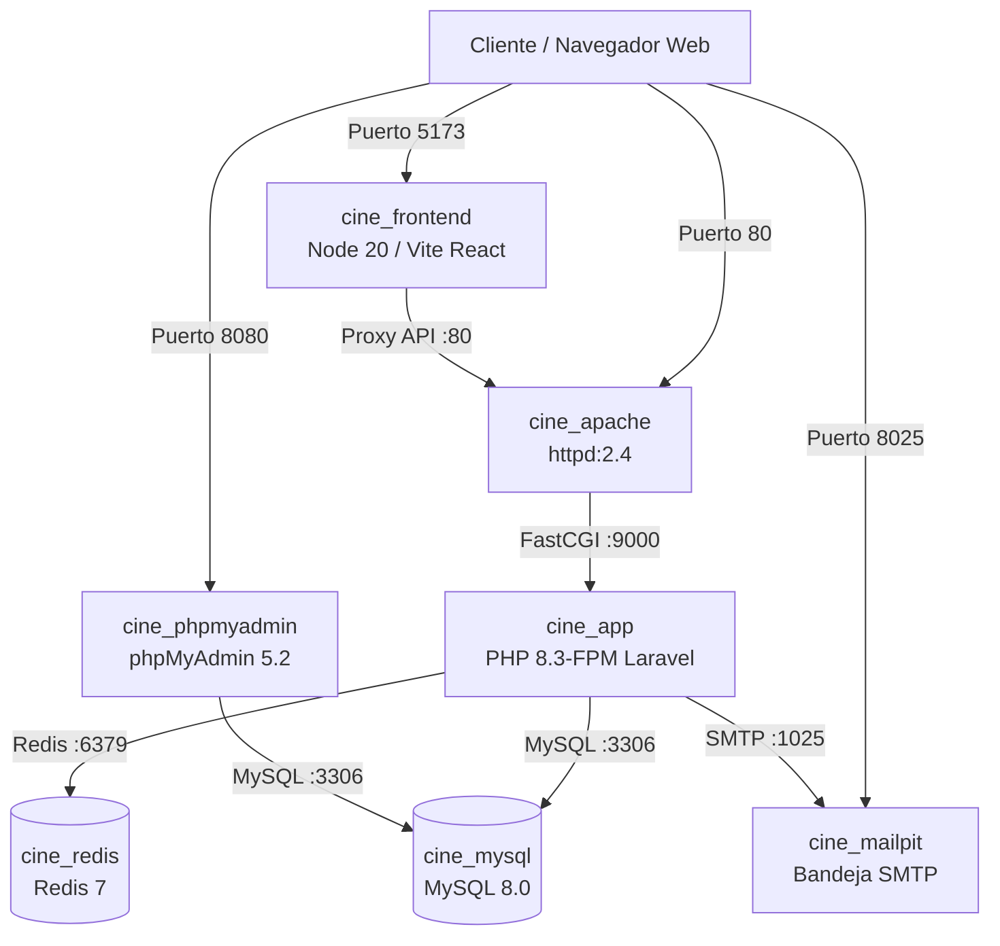
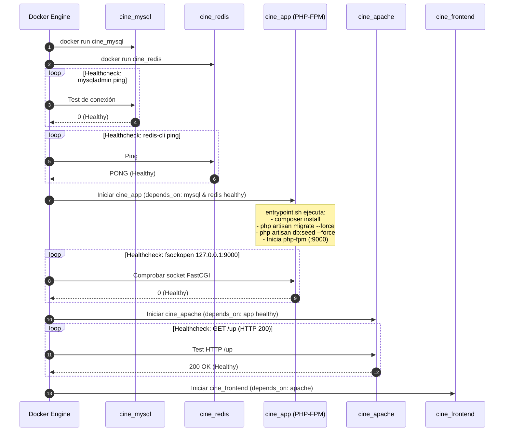

# Examen Teórico y Memoria Técnica de Implementación
## Proyecto Integrador: Cine Sendera — Contenerización y Arquitectura LAMP con Docker

---

### 📌 Información del Proyecto
- **Proyecto:** Cine Sendera (Sistema de Gestión y Venta de Boletos de Cine)
- **Stack Tecnológico:** React 18 (Frontend SPA) + Laravel 13 / PHP 8.3-FPM (Backend API) + Apache 2.4 (Web Server / Proxy) + MySQL 8.0 (Base de Datos) + Redis 7 (Caché/Sesiones) + Mailpit (SMTP Dev)
- **Orquestación e Infraestructura:** Docker Engine, Dockerfile Multi-Stage, Docker Compose v2, Redes Bridge, Named Volumes, Healthchecks y `.env`
- **Fecha de Entrega:** Octubre 2026

---

## Índice de Contenidos
1. [Tema 1: Fundamentos de la Contenerización y Arquitectura LAMP](#tema-1-fundamentos-de-la-contenerización-y-arquitectura-lamp)
2. [Tema 2: Construcción y Optimización de Imágenes (Dockerfile, Multi-Stage Builds y `.dockerignore`)](#tema-2-construcción-y-optimización-de-imágenes-dockerfile-multi-stage-builds-y-dockerignore)
3. [Tema 3: Estrategias de Almacenamiento y Persistencia (Named Volumes vs. Bind Mounts)](#tema-3-estrategias-de-almacenamiento-y-persistencia-named-volumes-vs-bind-mounts)
4. [Tema 4: Redes en Docker, Aislamiento y Resolución DNS Interna](#tema-4-redes-en-docker-aislamiento-y-resolución-dns-interna)
5. [Tema 5: Orquestación Declarativa con Docker Compose y Gestión de Variables (`.env`)](#tema-5-orquestación-declarativa-con-docker-compose-y-gestión-de-variables-env)
6. [Tema 6: Control del Orden de Arranque, Sincronización y Healthchecks](#tema-6-control-del-orden-de-arranque-sincronización-y-healthchecks)
7. [Matriz de Cumplimiento de Requerimientos del Examen / Proyecto](#matriz-de-cumplimiento-de-requerimientos-del-examen--proyecto)

---

## Tema 1: Fundamentos de la Contenerización y Arquitectura LAMP

### 1.1 Resumen Teórico

#### ¿Qué es la Contenerización?
La contenerización es una tecnología de virtualización a nivel de sistema operativo que permite empaquetar una aplicación junto con todas sus dependencias, librerías y configuraciones en una unidad estandarizada llamada **contenedor**. A diferencia de las máquinas virtuales tradicionales (VMs), los contenedores no virtualizan hardware ni ejecutan un kernel de SO completo por instancia; en su lugar, comparten el kernel del sistema anfitrión (*Host Kernel*), haciéndolos órdenes de magnitud más ligeros, rápidos de iniciar y eficientes en el uso de recursos.

```
┌─────────────────────────────────────────┐     ┌─────────────────────────────────────────┐
│           Máquinas Virtuales            │     │               Contenedores              │
├───────────────────┬─────────────────────┤     ├───────────────────┬─────────────────────┤
│   App A + Libs    │    App B + Libs     │     │   App A + Libs    │    App B + Libs     │
├───────────────────┼─────────────────────┤     ├───────────────────┴─────────────────────┤
│  Guest OS (Linux) │   Guest OS (Win)    │     │       Motor Docker (Docker Engine)      │
├───────────────────┴─────────────────────┤     ├─────────────────────────────────────────┤
│        Hypervisor (Tipo 1 / 2)          │     │        Kernel del Host (Linux)          │
├─────────────────────────────────────────┤     ├─────────────────────────────────────────┤
│          Hardware del Servidor          │     │          Hardware del Servidor          │
└─────────────────────────────────────────┘     └─────────────────────────────────────────┘
```

#### Primitivas del Kernel de Linux que Hacen Posible Docker:
1. **Namespaces (Aislamiento de Recursos):**
   - `pid` (Process ID): Los procesos dentro del contenedor solo se ven a sí mismos, iniciando con PID 1.
   - `net` (Network): Cada contenedor tiene su propia interfaz de red (`eth0`), tabla de enrutamiento y puertos.
   - `mnt` (Mount): Aísla el árbol del sistema de archivos.
   - `ipc` (Inter-Process Communication): Separa colas de mensajes y memoria compartida.
   - `uts` (Hostname): Permite que cada contenedor tenga su propio nombre de host.
   - `user`: Mapea UIDs/GIDs del contenedor a usuarios sin privilegios en el host.
2. **Control Groups (cgroups - Control de Recursos):**
   - Limitan, miden y aíslan el consumo de recursos físicos (CPU, memoria RAM, I/O de disco y red) por contenedor.
3. **Union File System (UnionFS / OverlayFS):**
   - Permite superponer capas de solo lectura con una capa superior de lectura/escritura (*Copy-on-Write*).

#### Principio Arquitectónico: Un Proceso por Contenedor (*Single Concern Principle*)
Una buena práctica en entornos contenerizados es evitar los contenedores monolíticos que ejecutan múltiples demonios (`systemd`, Apache, MySQL y cron juntos en una sola imagen). Cada contenedor debe tener una responsabilidad única, facilitando escalabilidad horizontal, aislamiento de fallos, logs independientes y actualizaciones sin tiempo de inactividad.

---

### 1.2 Implementación en Cine Sendera

En **Cine Sendera**, se adoptó una arquitectura LAMP moderna y desacoplada bajo el principio de un proceso por contenedor:



#### Justificación del Desacoplamiento Apache $\leftrightarrow$ PHP-FPM:
En lugar de usar el módulo tradicional `mod_php` incrustado en Apache (que fuerza a cada worker de Apache a cargar el intérprete de PHP para servir incluso imágenes estáticas), se separó:
1. **`cine_apache` (Servidor Web):** Se encarga exclusivamente de resolver peticiones HTTP, servir recursos estáticos (`.css`, `.js`, imágenes) y delegar scripts dinámicos vía protocolo FastCGI a `app:9000` mediante `ProxyPassMatch`.
2. **`cine_app` (Worker de Aplicación PHP-FPM):** Ejecuta exclusivamente el runtime de Laravel con un pool de procesos dedicado en el puerto `9000`.

---

## Tema 2: Construcción y Optimización de Imágenes (Dockerfile, Multi-Stage Builds y `.dockerignore`)

### 2.1 Resumen Teórico

#### Anatomía de un Dockerfile y Sistema de Capas
Un `Dockerfile` es una receta declarativa de instrucciones para construir una imagen de Docker. Cada instrucción (`FROM`, `RUN`, `COPY`, `ADD`) genera una **capa de solo lectura** inmutable (*layer*). 

- **Layer Caching:** Docker almacena en caché el resultado de cada instrucción. Si los archivos fuente no cambian, Docker reutiliza la capa en construcciones posteriores.
- **Regla de Ordenación de Capas:** Las instrucciones que cambian con menor frecuencia (como la instalación de paquetes del sistema y dependencias) deben colocarse antes que las instrucciones que cambian frecuentemente (como el código fuente de la aplicación).

#### ¿Qué es el Patrón Multi-Stage Build?
En aplicaciones modernas (PHP, Node.js, Go), se requieren herramientas pesadas durante la fase de compilación (compiladores, SDKs, Composer, Node.js, NPM, Git) que **no se necesitan en el entorno de ejecución final**. 
El patrón **Multi-Stage Build** permite utilizar múltiples bloques `FROM` dentro del mismo `Dockerfile`. Cada etapa (*stage*) puede usar una imagen base distinta y copiar únicamente los binarios y artefactos generados hacia la imagen final, descartando los compiladores y dependencias de desarrollo.

**Beneficios del Multi-Stage Build:**
1. **Reducción radical del tamaño de la imagen:** Pasa de gigabytes a solo unos cientos de megabytes.
2. **Superficie de ataque reducida (Seguridad):** Al no incluir Node.js, npm, git ni compiladores en producción, se eliminan vectores de vulnerabilidad comunes.
3. **Imágenes limpias e inmutables.**

#### Importancia del archivo `.dockerignore`
El archivo `.dockerignore` define los patrones de archivos y carpetas que Docker debe excluir al enviar el **contexto de construcción** (*build context*) desde el cliente al demonio de Docker.
- **Previene fugas de seguridad:** Evita que archivos `.env`, llaves privadas o credenciales se horneen en las capas de la imagen.
- **Evita invalidación prematura de caché:** Ignora carpetas como `node_modules/`, `vendor/`, logs y `.git`.

---

### 2.2 Implementación en Cine Sendera

#### A. Entorno de Desarrollo ([`docker/php/Dockerfile`](file:///c:/Users/Manuel/Documents/cineweb/cine_web/docker/php/Dockerfile))
En desarrollo se prioriza la velocidad de iteración. La imagen incluye extensiones de PHP (`pdo_mysql`, `mbstring`, `zip`, `intl`, `pcntl`), copia el binario de Composer directamente desde la imagen oficial `composer:2` (`COPY --from=composer:2 /usr/bin/composer /usr/bin/composer`) y monta el código fuente mediante Bind Mount.

#### B. Optimización Multi-Stage en Producción ([`docker/php/Dockerfile.prod`](file:///c:/Users/Manuel/Documents/cineweb/cine_web/docker/php/Dockerfile.prod))
Para el despliegue de producción se implementó una construcción multi-etapa en 3 fases:

```dockerfile
# ─────────────────────────────────────────────────────────────────────────────
# Stage 1 — Vendor PHP de Producción (sin herramientas dev)
# ─────────────────────────────────────────────────────────────────────────────
FROM composer:2 AS composer-builder
WORKDIR /app
COPY backend/composer.json backend/composer.lock ./
RUN composer install \
    --no-dev \
    --optimize-autoloader \
    --no-interaction \
    --no-scripts \
    --prefer-dist

# ─────────────────────────────────────────────────────────────────────────────
# Stage 2 — Build del Frontend React con Vite
# ─────────────────────────────────────────────────────────────────────────────
FROM node:20-alpine AS frontend-builder
WORKDIR /project/frontend
COPY frontend/package*.json ./
RUN npm ci --prefer-offline
COPY frontend/ ./
RUN mkdir -p /project/backend/public/build && npm run build

# ─────────────────────────────────────────────────────────────────────────────
# Stage 3 — Imagen Final de Ejecución PHP 8.3-FPM
# ─────────────────────────────────────────────────────────────────────────────
FROM php:8.3-fpm
RUN apt-get update && apt-get install -y \
        curl git unzip zip \
        libzip-dev libpng-dev libonig-dev libxml2-dev \
        default-mysql-client cron \
    && apt-get clean && rm -rf /var/lib/apt/lists/*

RUN docker-php-ext-install pdo pdo_mysql mbstring zip exif pcntl opcache

# Configuración de OPcache para máxima velocidad en producción
RUN { \
        echo 'opcache.enable=1'; \
        echo 'opcache.memory_consumption=256'; \
        echo 'opcache.max_accelerated_files=20000'; \
        echo 'opcache.validate_timestamps=0'; \
    } > /usr/local/etc/php/conf.d/opcache.ini

WORKDIR /var/www
COPY backend/ .
# Copia exclusiva de artefactos compilados desde los stages anteriores
COPY --from=composer-builder /app/vendor ./vendor
COPY --from=frontend-builder /project/backend/public/build ./public/build

# Permisos de runtime para Laravel
RUN chown -R www-data:www-data storage bootstrap/cache && chmod -R 775 storage bootstrap/cache

ENTRYPOINT ["/usr/local/bin/entrypoint.sh"]
CMD ["php-fpm"]
```

#### C. Exclusión con `.dockerignore` ([`.dockerignore`](file:///c:/Users/Manuel/Documents/cineweb/cine_web/.dockerignore))
Se configuraron reglas estrictas para mantener el contexto limpio:
```dockerignore
backend/.env
backend/.env.*
!backend/.env.example
.env.prod
backend/vendor/
frontend/node_modules/
backend/storage/logs/*
backend/database/database.sqlite
.git
docs/
```

---

## Tema 3: Estrategias de Almacenamiento y Persistencia (Named Volumes vs. Bind Mounts)

### 3.1 Resumen Teórico

Por defecto, todos los archivos creados dentro de un contenedor se almacenan en la capa de escritura efímera (*writable layer*). Cuando el contenedor se elimina con `docker rm` o `docker compose down`, estos datos **se pierden irremediablemente**.

Docker ofrece tres mecanismos para gestionar datos persistentes:

```
┌─────────────────────────────────────────────────────────────────────────┐
│                      Mecanismos de Almacenamiento                       │
├──────────────────────┬──────────────────────┬───────────────────────────┤
│    Named Volumes     │     Bind Mounts      │        tmpfs Mounts       │
├──────────────────────┼──────────────────────┼───────────────────────────┤
│ Gestionados por      │ Enlazados a una ruta │ Almacenados solo en la    │
│ Docker en:           │ arbitraria del host  │ memoria RAM del anfitrión │
│ /var/lib/docker/     │ (ej. ./backend)      │ (nunca tocan el disco)    │
│ volumes/             │                      │                           │
├──────────────────────┼──────────────────────┼───────────────────────────┤
│ Aislados, seguros,   │ Edición en tiempo    │ Datos volátiles, sesiones │
│ alto rendimiento en  │ real, dependientes   │ temporales, seguridad de  │
│ Linux/Win/Mac        │ de la ruta del host  │ secretos en memoria       │
└──────────────────────┴──────────────────────┴───────────────────────────┘
```

#### Comparativa Técnica:
1. **Named Volumes (`volumen:/ruta`):**
   - El ciclo de vida de los datos es completamente independiente del contenedor.
   - Rendimiento optimizado (evita el overhead del sistema de archivos virtual en Docker Desktop).
   - Ideal para bases de datos (MySQL, PostgreSQL, Redis).
2. **Bind Mounts (`./host_dir:/container_dir`):**
   - Mapea un archivo o directorio del host dentro del contenedor.
   - Ideal para desarrollo: cualquier cambio en el código se refleja al instante sin reconstruir la imagen.
   - Permite versionar archivos de configuración individuales (`php.ini`, `httpd.conf`) en Git.

---

### 3.2 Implementación en Cine Sendera

En el archivo [`docker-compose.yml`](file:///c:/Users/Manuel/Documents/cineweb/cine_web/docker-compose.yml), se aplicó la regla fundamental de arquitectura: **Lo que el desarrollador edita vive en Bind Mounts; lo que solo el motor del servicio gestiona vive en Named Volumes**.

```yaml
services:
  app:
    volumes:
      - ./backend:/var/www                              # Bind Mount: Código fuente en caliente
      - ./docker/php/php-dev.ini:/usr/local/etc/php/conf.d/99-dev.ini # Bind Mount: Configuración

  apache:
    volumes:
      - ./backend:/var/www                              # Bind Mount: Acceso a assets públicos
      - ./docker/apache/000-default.conf:/usr/local/apache2/conf/httpd.conf # Bind Mount: Vhost

  mysql:
    volumes:
      - mysql_data:/var/lib/mysql                       # Named Volume: Datos persistentes InnoDB

  redis:
    volumes:
      - redis_data:/data                                # Named Volume: Persistencia RDB/AOF

volumes:
  mysql_data:
  redis_data:
```

#### Demostración de Persistencia:
Al ejecutar `docker compose down`, los contenedores son destruidos. Al volver a ejecutar `docker compose up -d`, las compras, películas y usuarios creados en MySQL permanecen intactos porque `mysql_data` no se elimina (a menos que se use explícitamente `docker compose down -v`).

---

## Tema 4: Redes en Docker, Aislamiento y Resolución DNS Interna

### 4.1 Resumen Teórico

#### Drivers de Red en Docker
Docker proporciona diferentes controladores de red según las necesidades de aislamiento:
- **`bridge` (Por defecto):** Crea una interfaz de puente virtual en el host (`docker0` o personalizada). Los contenedores en la misma red pueden comunicarse entre sí por TCP/UDP.
- **`host`:** El contenedor comparte directamente la pila de red del host (sin aislamiento de puertos).
- **`none`:** Deshabilita toda la red en el contenedor (máximo aislamiento).
- **`overlay`:** Permite comunicación entre contenedores alojados en diferentes hosts físicos (Docker Swarm / Kubernetes).

#### Red Default Bridge vs. Red Custom Bridge
| Característica | Default Bridge (`bridge`) | Custom Bridge (`networks: [cine_network]`) |
| :--- | :--- | :--- |
| **Resolución DNS** | ❌ No incluye DNS interno. Solo permite conexión por IP o `--link` manual. | ✅ **Servidor DNS embebido de Docker (`127.0.0.11`)**. Resuelve nombres de servicio automáticamente. |
| **Aislamiento** | ⚠️ Todos los contenedores no asignados comparten la misma red por defecto. | 🔒 Aislamiento completo. Solo los contenedores conectados a esa red pueden comunicarse. |
| **Seguridad de Puertos** | Los puertos internos pueden interferir. | Puertos de backend no necesitan exponerse al host para comunicarse entre servicios. |

---

### 4.2 Implementación en Cine Sendera

Se definió una red dedicada tipo bridge llamada `cine_network` a la cual están conectados todos los servicios:

```yaml
networks:
  cine_network:
    driver: bridge
```

#### Tabla de Resolución DNS Interna en Cine Sendera:

| Servicio Origen | Servicio Destino | Nombre DNS / Puerto | Archivo de Configuración |
| :--- | :--- | :--- | :--- |
| `cine_apache` | `cine_app` | `app:9000` | `docker/apache/000-default.conf` (`proxy:fcgi://app:9000`) |
| `cine_app` | `cine_mysql` | `mysql:3306` | `.env` (`DB_HOST=mysql`) |
| `cine_app` | `cine_redis` | `redis:6379` | `.env` (`REDIS_HOST=redis`) |
| `cine_app` | `cine_mailpit` | `mailpit:1025` | `.env` (`MAIL_HOST=mailpit`) |
| `cine_phpmyadmin` | `cine_mysql` | `mysql:3306` | `docker-compose.yml` (`PMA_HOST: mysql`) |
| `cine_frontend` | `cine_apache` | `apache:80` | `docker-compose.yml` (`VITE_PROXY_TARGET: http://apache`) |

> **Aislamiento de seguridad:** El servicio `cine_app` (PHP-FPM) no expone ningún puerto al host; solo es accesible por `cine_apache` dentro de `cine_network`.

---

## Tema 5: Orquestación Declarativa con Docker Compose y Gestión de Variables (`.env`)

### 5.1 Resumen Teórico

#### ¿Qué es Docker Compose?
Docker Compose es una herramienta para definir y ejecutar aplicaciones Docker multicontenedor mediante un archivo declarativo en formato YAML (`docker-compose.yml`). Permite crear servicios, redes, volúmenes y dependencias con un único comando unificado (`docker compose up`).

#### Gestión de Variables de Entorno y Metodología Twelve-Factor App
El principio **III. Configuración** de la metodología *The Twelve-Factor App* establece que la configuración variable entre entornos (credenciales, hosts, puertos, API keys) debe estar estrictamente separada del código fuente y almacenarse en variables de entorno.

#### Comparativa: `environment:` vs. `env_file:`
- **Declaración explícita (`environment:`):** Mapea cada variable manualmente. Provoca duplicación masiva, riesgo de omitir variables y dificultad para mantener sincronizados `.env` y el archivo YAML.
- **Inyección por archivo (`env_file:`):** Carga todas las variables de un archivo `.env` directamente al entorno del contenedor como *Single Source of Truth*.

---

### 5.2 Implementación en Cine Sendera (PR #28 / `fix/28-docker-env-file`)

#### A. Centralización con `env_file`
Se eliminó la duplicación de más de 40 variables de entorno en [`docker-compose.yml`](file:///c:/Users/Manuel/Documents/cineweb/cine_web/docker-compose.yml), reemplazándolas por:

```yaml
services:
  app:
    # ...
    env_file:
      - .env
```

#### B. Prevención de Colisiones de Puertos en el Host (`FORWARD_*`)
Para garantizar que cualquier desarrollador pueda correr el proyecto sin conflictos si ya tiene MySQL (puerto 3306) o phpMyAdmin (puerto 8080) corriendo en su máquina, se implementaron variables de sobreescritura con valores por defecto:

```yaml
services:
  mysql:
    ports:
      - "${FORWARD_DB_PORT:-3306}:3306"

  phpmyadmin:
    ports:
      - "${FORWARD_PMA_PORT:-8080}:80"
```

En `.env.example`:
```env
FORWARD_DB_PORT=3308
FORWARD_PMA_PORT=8081
```

---

## Tema 6: Control del Orden de Arranque, Sincronización y Healthchecks

### 6.1 Resumen Teórico

#### El Problema de las *Race Conditions* con `depends_on` Básico
En Docker Compose, la instrucción tradicional `depends_on: [mysql]` solo garantiza el orden en que se envía la orden de arranque (`docker run`), pero **no espera a que la aplicación dentro del contenedor esté lista para aceptar conexiones**. 

Esto genera fallos críticos al levantar el stack:
1. El backend intenta ejecutar migraciones de base de datos antes de que MySQL termine de inicializar el motor InnoDB $\rightarrow$ `SQLSTATE[HY000] [2002] Connection refused`.
2. El servidor web Apache arranca y recibe peticiones antes de que PHP-FPM abra el puerto 9000 $\rightarrow$ `502 Bad Gateway`.

#### Mecanismo de Healthchecks en Docker
Un **Healthcheck** es una prueba periódica ejecutada dentro del contenedor para verificar que el servicio está funcionando correctamente.
Parámetros:
- `test`: Comando a ejecutar. Si retorna código `0` es `healthy`, si retorna `1` es `unhealthy`.
- `interval`: Frecuencia con la que se ejecuta la prueba (ej. `10s`).
- `timeout`: Tiempo máximo de espera para la respuesta del comando (ej. `5s`).
- `retries`: Número de fallos consecutivos antes de marcar el contenedor como `unhealthy` (ej. `5`).
- `start_period`: Ventana de inicialización durante la cual los fallos no cuentan para el límite de reintentos (ej. `30s`).

Al combinar `healthcheck` con `depends_on: { servicio: { condition: service_healthy } }`, Docker Compose garantiza un arranque perfectamente ordenado y sin condiciones de carrera.

---

### 6.2 Implementación en Cine Sendera (PR #29 / `feat/29-healthchecks-depends-on`)

Se implementaron comprobaciones de salud nativas y dependencias estrictas en [`docker-compose.yml`](file:///c:/Users/Manuel/Documents/cineweb/cine_web/docker-compose.yml):



#### Especificación de Healthchecks Configurados:

1. **MySQL (`cine_mysql`):**
   ```yaml
   healthcheck:
     test: ["CMD", "mysqladmin", "ping", "-h", "localhost", "-u", "root", "-p$$MYSQL_ROOT_PASSWORD"]
     interval: 10s
     timeout: 5s
     retries: 5
     start_period: 30s
   ```
2. **Redis (`cine_redis`):**
   ```yaml
   healthcheck:
     test: ["CMD", "redis-cli", "ping"]
     interval: 10s
     timeout: 3s
     retries: 5
   ```
3. **Backend PHP-FPM (`cine_app`):**
   ```yaml
   healthcheck:
     test: ["CMD", "php", "-r", "$$fp = @fsockopen('127.0.0.1', 9000); exit($$fp ? 0 : 1);"]
     interval: 10s
     timeout: 5s
     retries: 5
     start_period: 30s
   depends_on:
     mysql:
       condition: service_healthy
     redis:
       condition: service_healthy
   ```
4. **Servidor Web Apache (`cine_apache`):**
   ```yaml
   healthcheck:
     test: ["CMD-SHELL", "bash -c 'exec 3<>/dev/tcp/127.0.0.1/80 && printf \"GET /up HTTP/1.0\\r\\nHost: localhost\\r\\n\\r\\n\" >&3 && read -r line <&3 && [[ \"$$line\" =~ 200 ]]'"]
     interval: 10s
     timeout: 5s
     retries: 3
     start_period: 10s
   depends_on:
     app:
       condition: service_healthy
   ```

---

## Matriz de Cumplimiento de Requerimientos del Examen / Proyecto

| # | Requerimiento Solicitado por el Profesor | Cómo se Cumple en Cine Sendera | Archivos del Repositorio |
| :-: | :--- | :--- | :--- |
| **1** | **Código fuente y Dockerfiles para cada servicio** | Contenedores para Frontend React, Backend Laravel PHP 8.3-FPM, Servidor Web Apache, MySQL 8, Redis 7 y Mailpit. | [`docker/php/Dockerfile`](file:///c:/Users/Manuel/Documents/cineweb/cine_web/docker/php/Dockerfile), [`docker-compose.yml`](file:///c:/Users/Manuel/Documents/cineweb/cine_web/docker-compose.yml) |
| **2** | **Optimización con Multi-stage builds y `.dockerignore`** | `Dockerfile.prod` en 3 etapas (Composer $\rightarrow$ Node.js/Vite $\rightarrow$ PHP-FPM con OPcache). `.dockerignore` filtra dependencias, artefactos y secretos. | [`docker/php/Dockerfile.prod`](file:///c:/Users/Manuel/Documents/cineweb/cine_web/docker/php/Dockerfile.prod), [`.dockerignore`](file:///c:/Users/Manuel/Documents/cineweb/cine_web/.dockerignore) |
| **3** | **Estrategia de persistencia (Named Volumes vs. Bind Mounts)** | Named volumes (`mysql_data`, `redis_data`) para datos de BD. Bind mounts (`./backend`, `./frontend`, configs) para desarrollo en caliente. | [`docker-compose.yml`](file:///c:/Users/Manuel/Documents/cineweb/cine_web/docker-compose.yml#L15-L106) |
| **4** | **Red personalizada tipo bridge y DNS interno** | Red custom `cine_network` (driver bridge). Comunicación transparente mediante DNS por nombre de servicio (`app`, `mysql`, `redis`, `apache`). | [`docker-compose.yml`](file:///c:/Users/Manuel/Documents/cineweb/cine_web/docker-compose.yml#L175-L176) |
| **5** | **Manifiesto Docker Compose funcional** | Levantamiento completo de toda la arquitectura con un solo comando: `docker compose up -d`. | [`docker-compose.yml`](file:///c:/Users/Manuel/Documents/cineweb/cine_web/docker-compose.yml) |
| **6** | **Variables de entorno (`.env`) + Control de arranque con `depends_on` y `healthcheck`** | Variables cargadas con `env_file: - .env` (PR #28). Orquestación estricta con `healthchecks` y `condition: service_healthy` (PR #29), eliminando errores 502. | [`docker-compose.yml`](file:///c:/Users/Manuel/Documents/cineweb/cine_web/docker-compose.yml#L21-L77), [`.env.example`](file:///c:/Users/Manuel/Documents/cineweb/cine_web/.env.example) |
